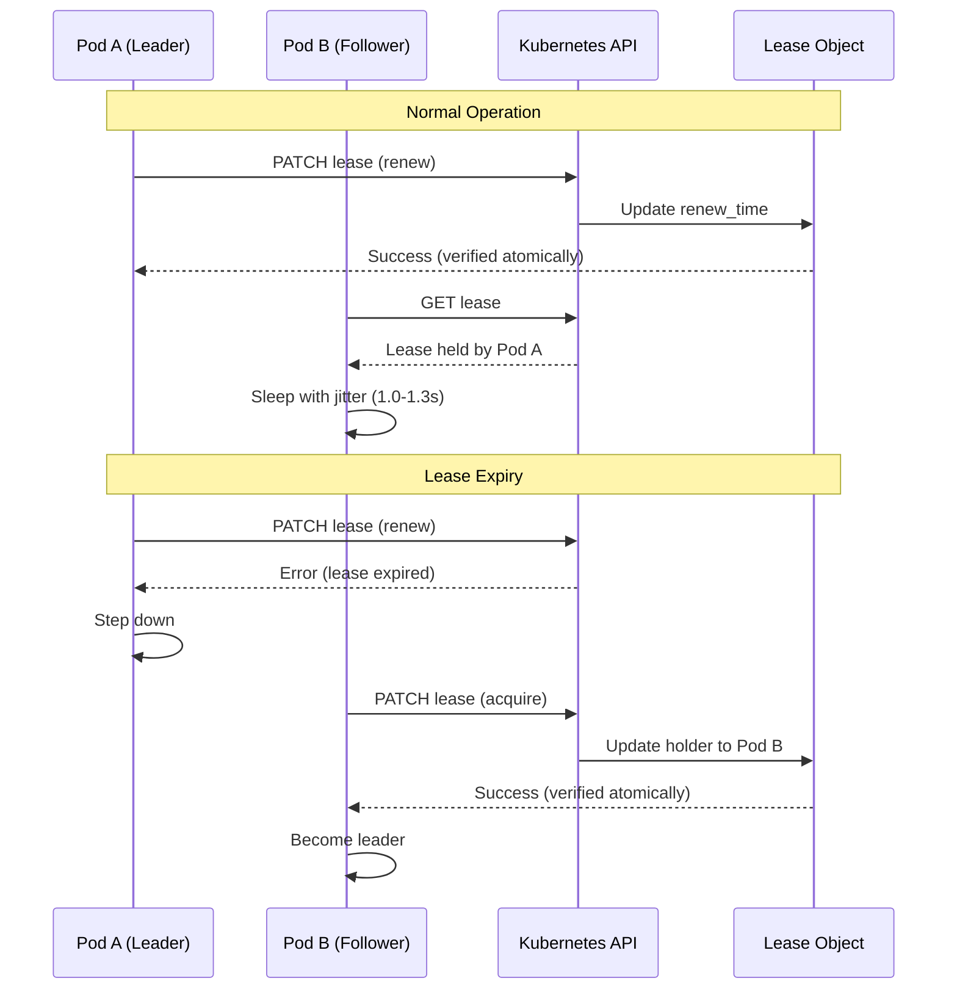
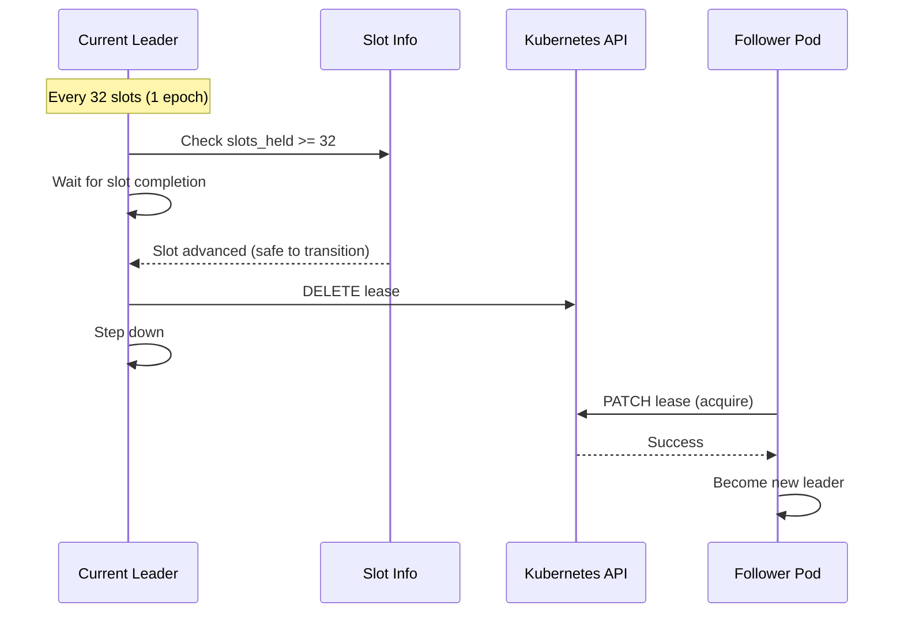
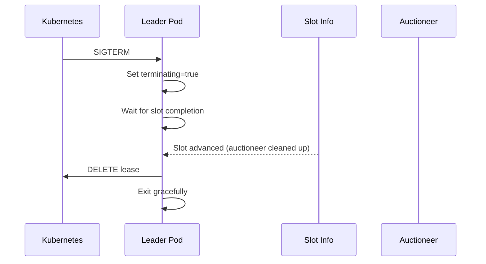

# Kubernetes Leader Election Module

This module provides Kubernetes-based leader election functionality for the Helix relay, enabling high availability deployments with automatic failover and slot-aware leadership transitions.

## Overview

The k8s module implements a distributed leader election system using Kubernetes Lease objects. It ensures that only one pod in a multi-pod deployment acts as the active leader at any time, with automatic failover, voluntary rotation, and graceful shutdown capabilities.

## Architecture

```
┌─────────────────┐    ┌─────────────────┐    ┌─────────────────┐
│   Pod A         │    │   Pod B         │    │   Pod C         │
│   (Leader)      │    │   (Follower)    │    │   (Follower)    │
│                 │    │                 │    │                 │
│ ┌─────────────┐ │    │ ┌─────────────┐ │    │ ┌─────────────┐ │
│ │LeaseManager │ │    │ │LeaseManager │ │    │ │LeaseManager │ │
│ │             │ │    │ │             │ │    │ │             │ │
│ │ - Renews    │ │    │ │ - Tries to  │ │    │ │ - Tries to  │ │
│ │   lease     │ │    │ │   acquire   │ │    │ │   acquire   │ │
│ │ - Handles   │ │    │ │ - Waits     │ │    │ │ - Waits     │ │
│ │   rotation  │ │    │ │   with      │ │    │ │   with      │ │
│ │ - Shutdown  │ │    │ │   jitter    │ │    │ │   jitter    │ │
│ └─────────────┘ │    │ └─────────────┘ │    │ └─────────────┘ │
└─────────────────┘    └─────────────────┘    └─────────────────┘
         │                       │                       │
         └───────────────────────┼───────────────────────┘
                                 │
                    ┌─────────────────┐
                    │ Kubernetes API  │
                    │                 │
                    │ ┌─────────────┐ │
                    │ │ Lease Object│ │
                    │ │             │ │
                    │ │ - Holder    │ │
                    │ │ - RenewTime │ │
                    │ │ - Duration  │ │
                    │ └─────────────┘ │
                    └─────────────────┘
```

## Components

### 1. LeaseManager (`lease_manager.rs`)

The core component that manages Kubernetes Lease-based leader election.

**Key Features:**
- **Lease Acquisition**: Attempts to acquire leadership using Kubernetes Lease objects
- **Atomic Verification**: Verifies ownership from patch responses to eliminate race conditions
- **Strategic Merge PATCH**: Uses Kubernetes Strategic Merge PATCH for better conflict resolution
- **Jittered Retries**: Adds random jitter to prevent thundering herd during retries
- **Voluntary Rotation**: Automatically rotates leadership every N slots (default: 32 slots = 1 epoch)
- **Graceful Shutdown**: Waits for slot completion before releasing leadership

**Configuration:**
```rust
K8sLeaderElectionConfig {
    enabled: true,
    lease_name: "helix-relay-leader",
    lease_duration_seconds: 1.0,      // Lease expires after 1s without renewal
    renew_deadline_seconds: 0.5,      // Leader renews at 0.5s (0.5s head start)
    retry_period_seconds: 1.0,        // Followers check every 1s
    slot_completion_timeout_seconds: 4, // Wait up to 4s for slot completion
    rotation_interval_slots: Some(32), // Rotate every 32 slots (1 epoch)
}
```

**Lifecycle:**
1. **Startup**: Initialize K8s client, read pod identity from `HOSTNAME` env var
2. **Acquisition**: Try to acquire lease, verify ownership atomically
3. **Leadership**: Renew lease every `renew_deadline_seconds`, handle rotation
4. **Transition**: Wait for slot completion before releasing lease
5. **Shutdown**: Graceful shutdown with slot-aware transition

### 2. Health Checks (`health.rs`)

Provides Kubernetes health check endpoints for leader election.

**Endpoints:**
- `GET /health/leader` - Readiness probe endpoint
  - Returns `200 OK` if pod is leader and not terminating
  - Returns `503 SERVICE_UNAVAILABLE` if follower or terminating

**Integration:**
- Used by Kubernetes `readinessProbe` to determine pod readiness
- Only the leader pod is marked as "Ready" and receives traffic
- Followers remain "Not Ready" but are healthy and ready to become leader

### 3. Slot-Aware Shutdown (`slot_aware_shutdown.rs`)

Ensures leadership transitions happen at safe slot boundaries to prevent mid-slot disruptions.

**Purpose:**
- Prevents dropping bids mid-slot during leadership changes
- Ensures proposers who received a header can successfully call `get_payload`
- Maintains auction integrity during transitions

**Mechanism:**
1. **Wait for Slot Advancement**: Monitors for `on_new_slot()` events from auctioneer
2. **Fail-safe Timeout**: Falls back to timeout (4s into next slot) if slot doesn't advance
3. **Safe Transition**: Only transitions leadership after slot completion

**Transition Reasons:**
- `Shutdown`: External shutdown signal (SIGTERM/SIGINT)
- `Rotation`: Voluntary rotation at slot boundary
- `LeaseLost`: Lost lease unexpectedly (network issue, evicted)

### 4. Metrics (`metrics.rs`)

Prometheus metrics for monitoring leader election behavior.

**Metrics:**
- `helix_leader_election_state` (Gauge): Current leader state (1=leader, 0=follower)
- `helix_lease_renewals_total` (Counter): Total successful lease renewals
- `helix_lease_failures_total` (Counter): Total lease renewal failures
- `helix_leader_transitions_total` (Counter): Total leader transitions
- `helix_slot_completion_wait_seconds` (Histogram): Time waited for slot completion

## How It Works

### 1. Leader Election Process



### 2. Voluntary Rotation



### 3. Graceful Shutdown



## Configuration

### Kubernetes Deployment

```yaml
apiVersion: apps/v1
kind: Deployment
metadata:
  name: relay-api-auction-helix
spec:
  replicas: 3
  strategy:
    type: RollingUpdate
    rollingUpdate:
      maxSurge: 0
      maxUnavailable: 1
  template:
    spec:
      serviceAccountName: auction-helix
      terminationGracePeriodSeconds: 30
      containers:
      - name: relay-api-auction-helix
        image: helix-relay:latest
        env:
        - name: HOSTNAME
          valueFrom:
            fieldRef:
              fieldPath: metadata.name
        ports:
        - containerPort: 4040
          name: api
        readinessProbe:
          httpGet:
            path: /health/leader
            port: 4040
          initialDelaySeconds: 5
          periodSeconds: 1
          failureThreshold: 2
        livenessProbe:
          httpGet:
            path: /eth/v1/builder/status
            port: 4040
          initialDelaySeconds: 10
          periodSeconds: 10
```

### PodDisruptionBudget

```yaml
apiVersion: policy/v1
kind: PodDisruptionBudget
metadata:
  name: auction-helix-pdb
spec:
  minAvailable: 2
  selector:
    matchLabels:
      app: relay-api-auction-helix
```

### Relay Configuration

```yaml
k8s_leader_election:
  enabled: true
  lease_name: "helix-relay-leader"
  lease_duration_seconds: 1.0
  renew_deadline_seconds: 0.5
  retry_period_seconds: 1.0
  slot_completion_timeout_seconds: 4
  rotation_interval_slots: 32
```

## Edge Cases and Mitigations

### 1. Clock Skew
- **Issue**: Pod clocks may drift, causing incorrect lease expiry calculations
- **Mitigation**: Rely on Kubernetes API server time for lease operations

### 2. Network Partitions
- **Issue**: Leader loses network access but retains lease
- **Mitigation**: Lease expires naturally, followers acquire after timeout

### 3. K8s API Server Unavailability
- **Issue**: All pods lose ability to manage leases
- **Mitigation**: Kubernetes handles retries; brief leadership loss is acceptable

### 4. Race Conditions
- **Issue**: Multiple pods try to acquire lease simultaneously
- **Mitigation**: Strategic Merge PATCH + atomic verification + jittered retries

### 5. Mid-Slot Transitions
- **Issue**: Leadership changes during active auction processing
- **Mitigation**: Slot-aware shutdown waits for slot completion

## Monitoring

### Key Metrics to Monitor

1. **Leader Stability**: `helix_leader_election_state`
   - Should be 1 for exactly one pod
   - Frequent changes indicate instability

2. **Lease Health**: `helix_lease_renewals_total` vs `helix_lease_failures_total`
   - High failure rate indicates K8s API issues
   - Renewal rate should match expected frequency

3. **Transition Timing**: `helix_slot_completion_wait_seconds`
   - High values indicate slow slot processing
   - Timeout values indicate system issues

4. **Leader Transitions**: `helix_leader_transitions_total`
   - High rate indicates instability
   - Should correlate with voluntary rotations

### Alerts

```yaml
# Multiple leaders detected
- alert: MultipleLeaders
  expr: sum(helix_leader_election_state) > 1
  for: 30s
  labels:
    severity: critical

# No leader detected
- alert: NoLeader
  expr: sum(helix_leader_election_state) == 0
  for: 1m
  labels:
    severity: critical

# High lease failure rate
- alert: HighLeaseFailureRate
  expr: rate(helix_lease_failures_total[5m]) > 0.1
  for: 2m
  labels:
    severity: warning
```

## Troubleshooting

### Common Issues

1. **Pods stuck in 0/1 Ready state**
   - Check if leader election is enabled
   - Verify `/health/leader` endpoint returns 200 for leader
   - Check lease acquisition logs

2. **Frequent leader changes**
   - Check K8s API server health
   - Verify network connectivity
   - Check for clock skew between pods

3. **Slow rollouts**
   - Increase `terminationGracePeriodSeconds`
   - Check slot completion timeout
   - Verify readiness probe configuration

4. **Lease contention**
   - Check for synchronized retries
   - Verify jitter is working
   - Consider increasing lease duration

### Debug Commands

```bash
# Check lease status
kubectl get lease helix-relay-leader -o yaml

# Check pod readiness
kubectl get pods -l app=relay-api-auction-helix

# Check leader health
kubectl exec -it <leader-pod> -- curl localhost:4040/health/leader

# View logs
kubectl logs -f <pod-name> | grep -E "(leader|lease|rotation)"
```

## Performance Characteristics

- **Lease Renewal**: Every 0.5s (configurable)
- **Follower Retry**: Every 1.0-1.3s with jitter
- **Rotation Interval**: Every 32 slots (~6.4 minutes on mainnet)
- **Shutdown Timeout**: Up to 4s for slot completion
- **API Calls**: 1 per renewal (atomic verification)

## Security Considerations

- **RBAC**: Pods need `coordination.k8s.io/leases` permissions
- **Network**: Secure communication with K8s API server
- **Identity**: Pod identity derived from `HOSTNAME` environment variable
- **Lease Names**: Use unique lease names per deployment to avoid conflicts

## Future Improvements

1. **Configurable Jitter**: Make jitter percentage configurable
2. **Health Endpoint Separation**: Separate readiness from leader status
3. **Metrics Enhancement**: Add more detailed timing metrics
4. **Circuit Breaker**: Add circuit breaker for K8s API calls
5. **Lease Preemption**: Support for lease preemption during high-priority transitions
